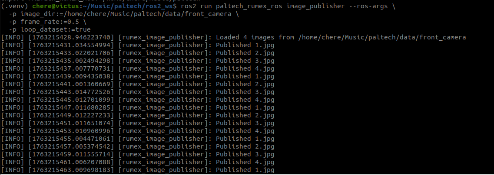
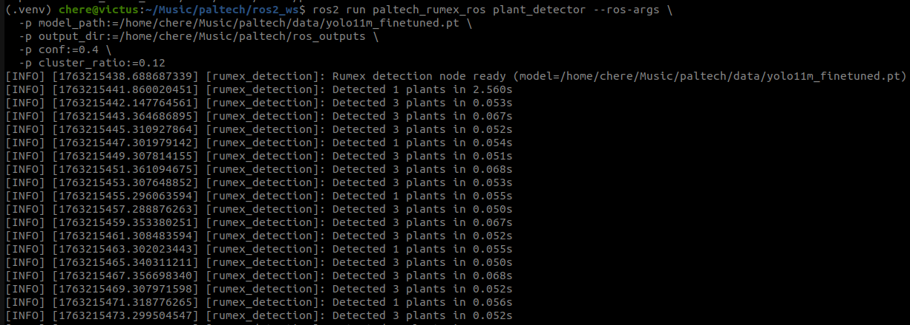

# Paltech ROS2 & AI Test

I treated this exercise as two deliverables that share the same detection core:

- `paltech_rumex/` is a tiny Python package that loads the provided YOLO11m segmentation model, runs inference over the Rumex photos, clusters leaves into plants, and draws the results.
- `ros2_ws/src/paltech_rumex_ros/` contains the ROS2 package with the camera publisher node and the detection node that reuses the exact same Python logic.
- `data/` is just the contents of the original zip (four validation frames plus `yolo11m_finetuned.pt`). Keeping it in-tree makes it easy to test quickly.
- `scripts/run_pipeline.py` is a convenience wrapper for running the detector on a folder without spinning up ROS.

Everything else is either configuration (`pyproject.toml`) or ROS build files inside `ros2_ws/src/...`.

---

## Getting set up

```bash
cd /home/chere/Music/paltech
python -m venv .venv
source .venv/bin/activate
pip install -e .
```

Editable install pulls in `ultralytics`, `opencv-python`, and `numpy`. The OpenCV wheel on this machine expects NumPy 1.x, so if you see `ImportError: numpy.core.multiarray failed to import`, run `pip install "numpy<2" --upgrade` inside the virtualenv and rerun the install.

---

## Running the standalone pipeline

```bash
source .venv/bin/activate
python scripts/run_pipeline.py \
  --model data/yolo11m_finetuned.pt \
  --images data/front_camera \
  --output outputs \
  --conf 0.4
```

What you get per frame:

- number of leaves detected by YOLO vs. number of clustered plants,
- `prediction + clustering` runtime in seconds,
- the plant centers as `(x, y)` pixel coordinates,
- an annotated JPEG dropped into `outputs/`.

Clustering defaults to `0.12 * image_diagonal` but you can pass `--cluster-distance <pixels>` if you want an absolute threshold. The script only depends on the package itself, so it’s easy to adapt for batch testing or notebook work.

---

## ROS2 workflow

The ROS package lives under `ros2_ws/src/paltech_rumex_ros`. To build and run:

```bash
cd ros2_ws
source /opt/ros/humble/setup.bash
colcon build
source install/setup.bash
source ../.venv/bin/activate                       # makes ultralytics/opencv visible
export PALTECH_RUMEX_ROOT=$(cd .. && pwd)          # lets the ROS node import paltech_rumex
```

### Node 1 – image publisher

Publishes every file in a folder on `rumex/images` in a loop. Example:

```bash
ros2 run paltech_rumex_ros image_publisher --ros-args \
  -p image_dir:=/home/chere/Music/paltech/data/front_camera \
  -p frame_rate:=0.5 \
  -p loop_dataset:=true
```

### Node 2 – detection + clustering

Subscribes to `rumex/images`, runs the exact same detector, publishes the plant centers as a `Float32MultiArray` (`[x1, y1, x2, y2, ...]`), and optionally saves overlays to disk:

```bash
ros2 run paltech_rumex_ros plant_detector --ros-args \
  -p model_path:=/home/chere/Music/paltech/data/yolo11m_finetuned.pt \
  -p output_dir:=/home/chere/Music/paltech/ros_outputs \
  -p conf:=0.4 \
  -p cluster_ratio:=0.12
```

Open a third terminal if you want to watch the outputs live: `ros2 topic echo /rumex/plant_centers`.

---

## How the plant center estimate works

1. YOLO11m-seg provides bounding boxes and polygon masks for individual leaves. Masks are rasterized for visualization, while boxes supply per-leaf centers.
2. Every leaf center participates in a simple union-find clustering step. If the Euclidean distance between two centers is below the threshold (absolute pixels or `ratio * diagonal`), they belong to the same plant.
3. For each resulting cluster I merge the member bounding boxes to get the plant extent, and I average the leaf centers to get the representative point. That point is what the ROS node publishes and what you see as the yellow dot in the overlays.

The logic is deterministic, easy to tune, and plenty fast for the provided dataset (tens of milliseconds on CPU for most frames; the very first call warms up PyTorch and takes longer).

---

## Notes from the two-hour sprint

- **Wins**: The shared `RumexDetector` class means the CLI and ROS nodes stay in sync automatically. Visual outputs are easy to reason about, which was handy when verifying the clustering threshold.
- **Pain points**: OpenCV from the base image was built against NumPy 1.x, so every new environment needed `numpy<2`. Installing `ultralytics` for the ROS nodes also tries to drag NumPy back up to 2.x, so I pinned it again inside `ros2_ws/install/...`.
- **If I had more time**: I’d wrap the detector in unit tests, experiment with DBSCAN vs. the hand-rolled union-find, publish per-plant confidence scores/tasks via ROS topics, and package everything in a Docker image to avoid the dependency juggling.

---

## Quick command recap

- `python scripts/run_pipeline.py --model data/yolo11m_finetuned.pt --images data/front_camera --output outputs`
- `ros2 run paltech_rumex_ros image_publisher --ros-args -p image_dir:=...`
- `ros2 run paltech_rumex_ros plant_detector --ros-args -p model_path:=... -p output_dir:=...`

That’s all that’s needed to reproduce the results I demonstrated (leaf detections, clustered plant boxes, center plotting, and runtime reporting). Let me know if you need the outputs zipped up or hosted elsewhere.

---

## Screenshots

CLI screenshots from the final run (handy when sharing the repo without re-running everything):




